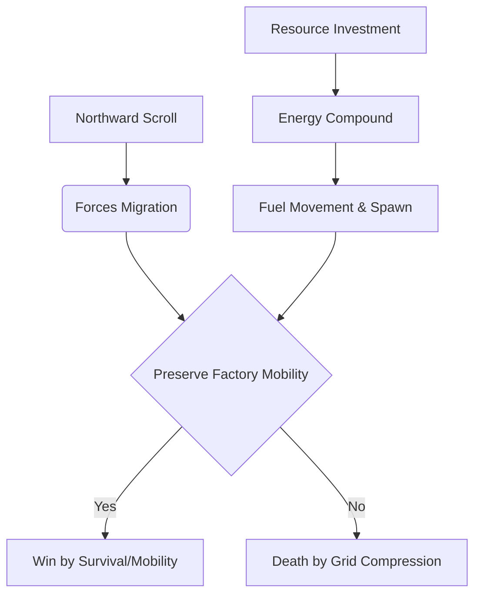

# Maze Crawler Intelligent Bot Specification & Architecture

This document serves as the master blueprint and reference guide for designing, building, and refining a top-tier classical AI agent for Kaggle's Maze Crawler competition. 

---

## Crawl: Getting Started

This guide walks you through building an agent, testing it locally, and submitting it to the Crawl competition on Kaggle.

### Game Overview
Crawl is a two-player real-time strategy game on a 20-wide maze that scrolls northward over time. Each player starts with a single Factory and must build robots to explore, collect energy, and outlast the opponent.

*   **Factory (indestructible)** builds Scouts, Workers, and Miners; can JUMP every 20 turns
*   **Scout (cost 50)** is fast with vision range 5 — your eyes
*   **Worker (cost 200)** builds and removes walls (100 energy per action)
*   **Miner (cost 300)** can TRANSFORM on a mining node into a mine that generates 50 energy/turn
*   **Maze** has east/west symmetry with occasional doors; both players see only what their robots see (fog of war)
*   **Combat:** when robots end the turn on the same cell, crush rules apply (Factory > Miner > Worker > Scout). Same-type collisions destroy all parties — friendly fire is real
*   **Scrolling:** the southern boundary advances, destroying anything left behind. Speed ramps from 1/4 turns to 1/turn by step 400
*   **Win condition:** last factory standing wins; if both survive to step 500, tiebreaker cascade is total energy → unit count → draw

See How to Play Maze Crawler for full rules and configuration defaults.

### Your Agent
Your agent is a function that receives an observation and configuration and returns a dict mapping robot UIDs to action strings.

**Observation fields:**
*   `obs.player` — your player index (0 or 1)
*   `obs.walls` — flat array of wall bitfields. Index = (row - southBound) * width + col. Value -1 = undiscovered. Bits: N=1, E=2, S=4, W=8
*   `obs.crystals` — `{"col,row": energy}`, only currently visible
*   `obs.robots` — `{"uid": [type, col, row, energy, owner, move_cd, jump_cd, build_cd]}`. Types: 0=Factory, 1=Scout, 2=Worker, 3=Miner
*   `obs.mines` — `{"col,row": [energy, maxEnergy, owner]}`, remembered once seen
*   `obs.miningNodes` — `{"col,row": 1}`, only currently visible
*   `obs.southBound`, `obs.northBound` — current active row range

**Action format:** Each value is an action string keyed by robot UID:
*   **Movement:** `NORTH`, `SOUTH`, `EAST`, `WEST`, `IDLE`
*   **Factory:** `BUILD_SCOUT`, `BUILD_WORKER`, `BUILD_MINER`, `JUMP_NORTH/SOUTH/EAST/WEST`
*   **Worker:** `BUILD_NORTH/SOUTH/EAST/WEST`, `REMOVE_NORTH/SOUTH/EAST/WEST`
*   **Miner:** `TRANSFORM` (must be on a mining node)
*   **Any robot:** `TRANSFER_NORTH/SOUTH/EAST/WEST` to send all energy to an adjacent friendly

**Example — Build a Worker, March North:**

```python
from random import choice

def agent(obs, config):
    actions = {}
    width = config.width
    my_robots = {
        uid: data for uid, data in obs.robots.items()
        if data[4] == obs.player
    }

    for uid, data in my_robots.items():
        rtype, col, row, energy = data[0], data[1], data[2], data[3]
        build_cd = data[7] if len(data) > 7 else 0

        idx = (row - obs.southBound) * width + col
        w = obs.walls[idx] if 0 <= idx < len(obs.walls) and obs.walls[idx] != -1 else 0

        if rtype == 0:  # Factory
            if w & 1:
                actions[uid] = "JUMP_NORTH"
            elif energy >= config.workerCost and build_cd == 0:
                actions[uid] = "BUILD_WORKER"
            else:
                actions[uid] = "NORTH"
        elif rtype == 2 and (w & 1) and energy >= config.wallRemoveCost:
            actions[uid] = "REMOVE_NORTH"
        else:
            passable = []
            if not (w & 1): passable.append("NORTH")
            if not (w & 2): passable.append("EAST")
            if not (w & 4): passable.append("SOUTH")
            if not (w & 8): passable.append("WEST")
            actions[uid] = "NORTH" if "NORTH" in passable else (choice(passable) if passable else "IDLE")

    return actions
```

### Test Locally
Install the environment from PyPI:

```bash
pip install kaggle-environments
```

Run a game from Python or a notebook:

```python
from kaggle_environments import make

env = make("crawl", configuration={"randomSeed": 42}, debug=True)
env.run(["main.py", "random"])

# View result
final = env.steps[-1]
for i, s in enumerate(final):
    print(f"Player {i}: reward={s.reward}, status={s.status}")

# Render in a notebook
env.render(mode="ipython", width=800, height=800)
```

### Set Up the Kaggle CLI
Install the CLI:

```bash
pip install kaggle
```

You'll need a Kaggle account — sign up at https://www.kaggle.com if you don't have one. Then download your API credentials at https://www.kaggle.com/settings/api by clicking "Generate New Token" under the "API" section.

**Recommended: API token file.** Save the token string to `~/.kaggle/access_token`:

```bash
mkdir -p ~/.kaggle
# Paste the token from the Kaggle settings UI into this file
nano ~/.kaggle/access_token
chmod 600 ~/.kaggle/access_token
```

**Alternative auth methods:**
*   OAuth (browser flow): `kaggle auth login`
*   Environment variable: `export KAGGLE_API_TOKEN=xxxxxxxxxxxxxx`

Verify the CLI is wired up:

```bash
kaggle competitions list -s "maze-crawler"
```

### Find the Competition
```bash
kaggle competitions list -s "maze-crawler"
kaggle competitions pages maze-crawler
kaggle competitions pages maze-crawler --content
```

### Accept the Competition Rules
Before submitting, you must accept the rules on the Kaggle website. Navigate to https://www.kaggle.com/competitions/maze-crawler and click "Join Competition".

Verify you've joined:

```bash
kaggle competitions list --group entered
```

### Download Competition Data
```bash
kaggle competitions download maze-crawler -p crawl-data
```

### Submit Your Agent
Your submission must have a `main.py` at the root with an agent function.

**Single file agent:**

```bash
kaggle competitions submit maze-crawler -f main.py -m "Worker rush v1"
```

**Multi-file agent** — bundle into a `tar.gz` with `main.py` at the root:

```bash
tar -czf submission.tar.gz main.py helper.py model_weights.pkl
kaggle competitions submit maze-crawler -f submission.tar.gz -m "Multi-file agent v1"
```

**Notebook submission:**

```bash
kaggle competitions submit maze-crawler -k YOUR_USERNAME/crawl-agent -f submission.tar.gz -v 1 -m "Notebook agent v1"
```

### Monitor Your Submission
Check submission status:

```bash
kaggle competitions submissions maze-crawler
```

Note the submission ID from the output — you'll need it for episodes.

### List Episodes
Once your submission has played some games:

```bash
kaggle competitions episodes <SUBMISSION_ID>
```

CSV output for scripting:

```bash
kaggle competitions episodes <SUBMISSION_ID> -v
```

### Download Replays and Logs
Download the replay JSON for an episode (for visualization or analysis):

```bash
kaggle competitions replay <EPISODE_ID>
kaggle competitions replay <EPISODE_ID> -p ./replays
```

Download agent logs to debug your agent's behavior:

```bash
# Logs for the first agent (index 0)
kaggle competitions logs <EPISODE_ID> 0

# Logs for the second agent (index 1)
kaggle competitions logs <EPISODE_ID> 1 -p ./logs
```

### Check the Leaderboard
```bash
kaggle competitions leaderboard maze-crawler -s
```

### Typical Workflow
```bash
# Test locally
python -c "
from kaggle_environments import make
env = make('crawl', debug=True)
env.run(['main.py', 'random'])
print([(i, s.reward) for i, s in enumerate(env.steps[-1])])
"

# Submit
kaggle competitions submit maze-crawler -f main.py -m "v1"

# Check status
kaggle competitions submissions maze-crawler

# Review episodes
kaggle competitions episodes <SUBMISSION_ID>

# Download replay and logs
kaggle competitions replay <EPISODE_ID>
kaggle competitions logs <EPISODE_ID> 0

# Check leaderboard
kaggle competitions leaderboard maze-crawler -s
```

---


## 1. Core Competition Framework & Realizations

### Game Loop & Rules
*   **Grid & Viewport:** A 2-player RTS played on a grid with a dynamic Fog of War. The viewport continuously scrolls northward (increasing Y-coordinates).
*   **Victory Conditions:**
    1.  **Survival:** Be the last factory standing. If your factory gets crushed by the scrolling screen edge or trapped with no legal moves, you lose.
    2.  **Turn-500 Tiebreakers:** If both factories survive to turn 500:
        *   Primary: Total Energy.
        *   Secondary: Total Unit Count.
        *   Tertiary: Draw.

### The Core Paradigm Shift: "The Scroll is the Enemy"
Most baseline strategies treat Maze Crawler as a combat/skirmish game. This is a fatal misconception. Combat is secondary; **migration and logistics are primary**. 



---

## 2. The 5-Dimensional Resource Model

To build a competitive agent, we must optimize five distinct resources, rather than just raw energy:

| Resource | Description | Strategic Value |
| :--- | :--- | :--- |
| **Energy** | The fuel currency. Generated via crystals, starting pools, and mines. | High in early/mid game; decays in value towards the late game. |
| **Vision** | Fog of War coverage. Knowing the maze ahead and tracking enemy positions. | Highest value. Prevents running blind into dead ends or enemy traps. |
| **Space** | Open grid cells, corridor widths, and proximity to dead ends. | Crucial for factory navigation. Getting boxed in is game over. |
| **Tempo** | Action efficiency per turn. Unit movement cooldowns and factory jumps. | Determines how fast you can respond to hazards. Scout (tempo=1) vs Miner (tempo=slow). |
| **Positioning**| Absolute coordinate placement relative to the scroll threshold and center line. | Being too close to the bottom scroll boundary reduces decision time to zero. |

---

## 3. Unit Analysis & Utility Matrix

| Unit | Cost | Tempo (Cooldown) | Vision | Core Strategic Role | Tactical Exploits |
| :--- | :--- | :--- | :--- | :--- | :--- |
| **Scout** | 50 | 1 turn | 5 cells | Vision, crystal harvesting, enemy tracking, vanguard scouting. | High speed allows blocking enemy scouts or intercepting crystals. |
| **Worker** | 200 | 2 turns | 3 cells | Maze modifier. Can dig through walls or seal corridors. | Trapping enemy factory, opening escape lanes, creating chokepoints. |
| **Miner** | 300 | 2 turns | 3 cells | Economic compounder. Converts into a stationary Mine (+50 energy/turn). | High ROI early on; liability if built too close to the scroll threshold. |
| **Factory** | - | 2 turns / 20 (Jump) | 3 cells | Production center, anchor of survival. Can move or teleport. | Jump is your emergency escape button. Always keep its cooldown in mind. |

> [!WARNING]  
> **Friendly Fire & Collisions:** Same-type friendly units entering the same cell on the same turn will destroy both. Keep unit paths de-conflicted in your pathfinding module!

---

## 4. Chronological Phase Management

```
Turn 0                                   Turn 100                               Turn 300                      Turn 500
|-------------------------------------------|--------------------------------------|------------------------------|
|                EARLY GAME                 |               MID GAME               |          LATE GAME           |
|  - Scout Spam                             |  - Mine Deployment                    |  - Factory Migration Focus    |
|  - Map Discovery & Crystal Grabbing       |  - Worker Routing & Tunneling        |  - Abandon Mines             |
|  - Establish Symmetry Axis                |  - Enemy Harassment                  |  - Path Clearance & Survival  |
```

### Phase 1: Early Game (Turns 0 - 100)
*   **Goal:** Build information and early energy advantage.
*   **Action Plan:** Spawn scouts immediately. Fan them out to grab crystals and map the terrain.
*   **Goal Post:** Reveal the horizontal symmetry axis of the maze as early as possible.

### Phase 2: Mid Game (Turns 100 - 300)
*   **Goal:** Scale economy and configure the local maze.
*   **Action Plan:** Spawn miners near rich nodes. Spawn workers to begin clear-cutting safe corridors for the factory. Use workers to wall off paths leading to the enemy to prevent surprise infiltrations.
*   **Goal Post:** Build a comfortable energy buffer (1000+ energy) while keeping the factory moving north.

### Phase 3: Late Game (Turns 300 - 500)
*   **Goal:** Pure survival against the high-speed scroll.
*   **Action Plan:** Cease miner production. All active mines are written off once they near the scroll boundary. Focus entirely on factory routing. Use workers exclusively to destroy walls blockading the factory's path.
*   **Goal Post:** Guide the factory to turn 500 along the safest, widest corridors.

---

## 5. Tactical Mechanics

### Indirect Combat & Wall Manipulation
Direct skirmishing is inefficient and risky. Instead, use workers to alter the maze topology:
1.  **The Dead-End Trap:** If an enemy factory enters a deep corridor, send a worker to seal the exit with a wall.
2.  **Chokepoint Quarantine:** Build a diagonal wall seam that separates your half of the board from the enemy's, preventing their units from stealing your crystals.
3.  **Tunneling Escape:** If your factory is trapped by natural walls, have workers dig a shortcut to the adjacent corridor.

### Maze Symmetry Exploitation
The maze is generated with **East-West (horizontal) symmetry**.
*   Let the width of the board be $W$.
*   If you discover a wall at coordinate $(x, y)$, you can immediately infer there is a matching wall at $(W - 1 - x, y)$ in the fog of war.
*   Use this to pre-calculate pathing routes through unrevealed regions before your scouts even get there!

---

## 6. Modular Bot Architecture

A production-grade agent should be organized into five decoupled modules. This clean separation of concerns prevents spaghetti code and allows you to test or replace individual modules easily.

```
                  ┌──────────────────────────────┐
                  │   Strategic Phase Manager    │
                  └──────────────┬───────────────┘
                                 │ Decisions
                                 ▼
    ┌────────────────┐    ┌──────────────┐    ┌─────────────────┐
    │   Map Memory   │◄───┤ Role Assigner├───►│ Danger Heatmap  │
    └───────┬────────┘    └──────┬───────┘    └────────┬────────┘
            │                    │                     │
            │                    ▼                     │
            │           ┌────────────────┐             │
            └──────────►│  Pathfinder    │◄────────────┘
                        └───────┬────────┘
                                │
                                ▼
                        ┌────────────────┐
                        │ Output Actions │
                        └────────────────┘
```

### Module 1: Map Memory (`map_memory.py`)
Responsible for keeping state across turns, including cells hidden by the Fog of War.
*   **Tracks:** Unvisited cells, static walls, mined spots, visible crystals, and enemy positions.
*   **Inference Engine:** Applies horizontal symmetry reflections to fill in fogged areas.

### Module 2: Danger Heatmap (`heatmap.py`)
Generates a dynamic safety grid where each coordinate $(x, y)$ is assigned a float risk value.
*   **Risk Factors:**
    *   *Scroll Distance:* Cells close to the bottom boundary have higher risk.
    *   *Dead Ends:* Deep corridors with single exits have high risk (especially for the factory).
    *   *Enemy Proximity:* Cells near known enemy workers or combat units have moderate risk.
    *   *Congestion:* Coordinates targeted by multiple friendly units.

### Module 3: Role Assignment System (`role_assigner.py`)
Manages the agent's economy and assigns behavior roles to each spawned unit.
*   **Roles:**
    *   `EXPLORER`: Scout tasked with mapping unknown areas.
    *   `HARVESTER`: Scout targeted at collecting visible crystals.
    *   `MINER`: Miner searching for a secure mining node.
    *   `ENGINEER`: Worker focused on clearing obstacles for the factory or sealing paths.
    *   `ESCORT`: Worker protecting the factory from enemy wall-ins.

### Module 4: Pathfinder (`pathfinder.py`)
Calculates optimal routes using the map state and danger values.
*   **Implementation:** Start with BFS for path length optimization. Transition to A* to incorporate safety costs:
    $$\text{Cost}(u, v) = 1 + \alpha \times \text{Danger}(v)$$
*   **Constraints:**
    *   Avoids cells containing same-type friendly units on target arrival steps (collision avoidance).
    *   Scroll-aware: Rejects paths where coordinates fall below the predicted scroll line before arrival.

### Module 5: Strategic Phase Manager (`agent_brain.py`)
The orchestrator. Reads the turn counter, evaluates the current state, decides which units to build, and switches the global strategy.

---

## 7. Python Class Implementation Sketches

Below are clean Python skeletons to jumpstart your implementation. 

### Map Memory (with Symmetry Inference)
```python
import numpy as np

class MapMemory:
    def __init__(self, width: int, height: int):
        self.width = width
        self.height = height
        # 0 = Unknown, 1 = Empty, -1 = Wall
        self.grid = np.zeros((width, height), dtype=int)
        self.visited = np.zeros((width, height), dtype=bool)
        
    def update_cell(self, x: int, y: int, is_wall: bool):
        val = -1 if is_wall else 1
        self.grid[x, y] = val
        self.visited[x, y] = True
        
        # Mirror cell based on horizontal symmetry
        mirrored_x = self.width - 1 - x
        if not self.visited[mirrored_x, y]:
            self.grid[mirrored_x, y] = val
            
    def is_wall(self, x: int, y: int) -> bool:
        if x < 0 or x >= self.width or y < 0 or y >= self.height:
            return True
        return self.grid[x, y] == -1
```

### Danger Heatmap
```python
class DangerHeatmap:
    def __init__(self, width: int, height: int):
        self.width = width
        self.height = height
        self.heatmap = np.zeros((width, height), dtype=float)
        
    def compute_heatmap(self, map_memory: MapMemory, scroll_y: int, enemy_factory_pos: tuple):
        self.heatmap.fill(0.0)
        
        for y in range(scroll_y, self.height):
            for x in range(self.width):
                # 1. High risk near scroll boundary
                dist_to_scroll = y - scroll_y
                if dist_to_scroll < 5:
                    self.heatmap[x, y] += (5 - dist_to_scroll) * 2.0
                    
                # 2. Infinite danger for walls
                if map_memory.is_wall(x, y):
                    self.heatmap[x, y] = float('inf')
                    
                # 3. Increase risk near enemy factory
                if enemy_factory_pos:
                    ef_x, ef_y = enemy_factory_pos
                    dist = abs(x - ef_x) + abs(y - ef_y)
                    if dist < 6:
                        self.heatmap[x, y] += (6 - dist) * 0.5
                        
    def get_danger(self, x: int, y: int) -> float:
        if x < 0 or x >= self.width or y < 0 or y >= self.height:
            return float('inf')
        return self.heatmap[x, y]
```

### Scroll-Aware Pathfinder
```python
import heapq

class Pathfinder:
    def __init__(self, map_memory: MapMemory, heatmap: DangerHeatmap):
        self.map_memory = map_memory
        self.heatmap = heatmap
        
    def find_path(self, start: tuple, goal: tuple, current_turn: int, scroll_speed: float) -> list:
        # A* implementation mapping coordinates to (cost, x, y, path)
        open_set = []
        heapq.heappush(open_set, (0.0, start[0], start[1], [start]))
        visited = set()
        
        while open_set:
            cost, x, y, path = heapq.heappop(open_set)
            
            if (x, y) == goal:
                return path
                
            if (x, y) in visited:
                continue
            visited.add((x, y))
            
            # Predict scroll Y coordinate when we reach this cell
            step_count = len(path) - 1
            predicted_scroll_y = int(current_turn * scroll_speed) + int(step_count * scroll_speed)
            
            # Reject state if it's already eaten by scroll
            if y < predicted_scroll_y:
                continue
                
            for dx, dy in [(0, 1), (0, -1), (1, 0), (-1, 0)]:
                nx, ny = x + dx, y + dy
                if not self.map_memory.is_wall(nx, ny) and ny >= predicted_scroll_y:
                    danger_weight = self.heatmap.get_danger(nx, ny)
                    if danger_weight == float('inf'):
                        continue
                    new_cost = cost + 1.0 + danger_weight
                    heapq.heappush(open_set, (new_cost, nx, ny, path + [(nx, ny)]))
                    
        return [] # No path found
```

### Strategic Unit Production
```python
class StrategyManager:
    def __init__(self):
        self.phase = "EARLY"
        
    def update_phase(self, turn: int):
        if turn < 100:
            self.phase = "EARLY"
        elif turn < 300:
            self.phase = "MID"
        else:
            self.phase = "LATE"
            
    def get_spawn_decision(self, current_energy: int, unit_counts: dict) -> str:
        """
        Determines what unit type to spawn based on energy budget and strategy phase.
        Returns: 'SCOUT', 'WORKER', 'MINER', or None
        """
        if self.phase == "EARLY":
            if current_energy >= 50 and unit_counts['scout'] < 4:
                return 'SCOUT'
            if current_energy >= 300 and unit_counts['miner'] < 1:
                return 'MINER'
                
        elif self.phase == "MID":
            if current_energy >= 300 and unit_counts['miner'] < 3:
                return 'MINER'
            if current_energy >= 200 and unit_counts['worker'] < 2:
                return 'WORKER'
            if current_energy >= 50 and unit_counts['scout'] < 6:
                return 'SCOUT'
                
        elif self.phase == "LATE":
            # Focus on workers to dig/protect pathways, no miners
            if current_energy >= 200 and unit_counts['worker'] < 4:
                return 'WORKER'
            if current_energy >= 50 and unit_counts['scout'] < 2:
                return 'SCOUT'
                
        return None
```

---

## 8. Next Steps & Development Roadmap

1.  **Starter API Integration:** Plug the `MapMemory` update logic directly into the environment's observation loop.
2.  **Symmetry Validation:** Verify in practice whether crystals are perfectly mirrored or if only terrain is symmetrical.
3.  **Visualization Dashboard:** Write a simple ASCII or Pygame renderer of your `DangerHeatmap` and `MapMemory` grid to inspect how the pathfinder sees the world.
4.  **Bot Tuning:** Run local agent matches against standard random/greedy bots to calibrate the weight coefficients ($\alpha$) in the pathfinder.
