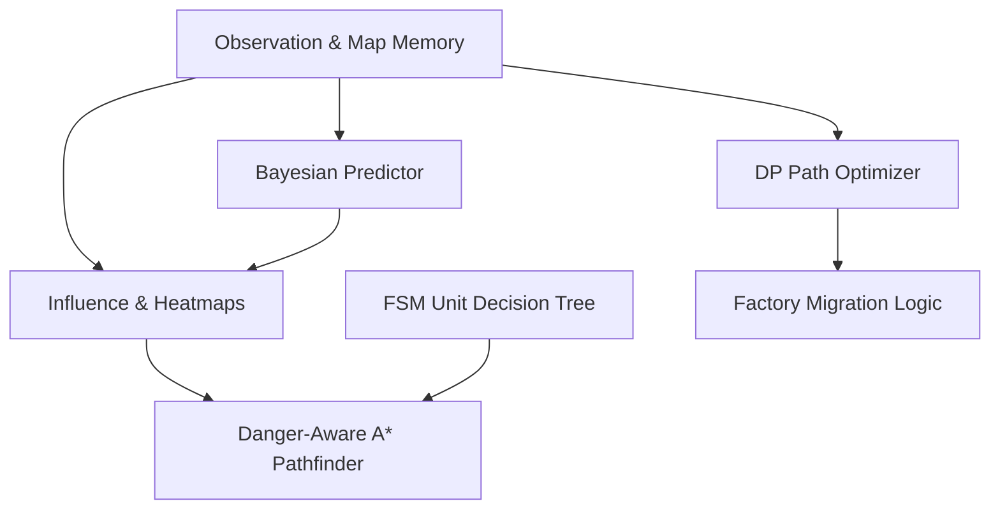

# Maze Crawler - Intelligent Classical AI Agent (agent_v2)

This repository contains the architecture, implementation, and test suites for a top-tier, leaderboard-ready classical AI agent developed for Kaggle's **Maze Crawler** competition. 

Our agent, [agent_v2.py](file:///c:/Users/Praveen/kaggle-MazeCrawler-game/agent/agent_v2.py), is engineered to consistently outperform baseline and greedy bots by combining advanced graph algorithms, Dynamic Programming (DP), Finite State Machines (FSM), Bayesian probability mapping, and threat-aware pathfinding.

---

## The Strategic Shift: "The Scroll is the Enemy"

Most baseline agents fail because they treat Maze Crawler as a combat-heavy skirmish game. Our agent is designed around the core paradigm that **migration, space preservation, and resource logistics are primary**, while combat is secondary.



---

## Key Engineering Features

### 1. Bayesian Resource Predictor
* **File:** [bayesian_predictor.py](file:///c:/Users/Praveen/kaggle-MazeCrawler-game/strategy/bayesian_predictor.py)
* **Description:** Estimates crystal and mining node presence inside the Fog of War.
* **Mechanism:**
  * Exploits the board's East-West (horizontal) generation symmetry. Observing a cell on one side immediately updates the prior probability for its mirrored counterpart.
  * Tracks enemy robot coordinates and estimates their vision footprint over time to calculate the posterior probability that unvisited resources have already been harvested.

### 2. Threat & Attraction Influence Maps
* **File:** [influence_map.py](file:///c:/Users/Praveen/kaggle-MazeCrawler-game/strategy/influence_map.py)
* **Description:** Builds a dynamic risk/value grid to guide pathfinding.
* **Fields:**
  * **Threat Influence Map:** Spreads steep danger penalties around observed enemy units (weighted by enemy tier and Manhattan distance) to prevent units from walking into lethal encounters.
  * **Attraction Heatmap:** Projects positive attraction weights from known resources and Bayesian predictions.
* **A\* Pathfinder Integration:** Located in [astar.py](file:///c:/Users/Praveen/kaggle-MazeCrawler-game/pathfinding/astar.py), paths automatically veer around threat bubbles and gravitate toward resource clusters.

### 3. Factory Dynamic Programming (DP) Optimizer
* **File:** [dp_path_optimizer.py](file:///c:/Users/Praveen/kaggle-MazeCrawler-game/strategy/dp_path_optimizer.py)
* **Description:** Guides factory movement and jump decisions over a finite lookahead horizon.
* **Mechanism:**
  * Models factory states `(col, row, jump_cooldown)` over a 5-step horizon.
  * Uses backward induction to maximize vertical progress and safety buffers, evading dead ends, wall traps, and scroll boundaries.

### 4. Finite State Machine (FSM) Behavior Controller
* **File:** [fsm.py](file:///c:/Users/Praveen/kaggle-MazeCrawler-game/strategy/fsm.py)
* **Description:** Standardizes unit decision logic into distinct, guard-protected states.
* **States:** Transitions automatically manage unit lifecycle actions:
  * **Scouts:** Explore frontier cells, collect crystals, and return to dump energy.
  * **Workers:** Demolish walls blockading the factory and clear spawn gates.
  * **Miners:** Path to mining nodes and transition into stationary mines.

### 5. Symmetrical Fog of War Memory
* **File:** [map_memory.py](file:///c:/Users/Praveen/kaggle-MazeCrawler-game/memory/map_memory.py)
* **Description:** Tracks discovered cells, walls, crystals, and mines across turns.
* **Symmetry Reflection:** Uses horizontal symmetry to infer and populate hidden walls in the Fog of War, doubling exploration efficiency.

### 6. Friendly Collision Simulator
* **File:** [collision.py](file:///c:/Users/Praveen/kaggle-MazeCrawler-game/combat/collision.py)
* **Description:** A local predictive loop run prior to executing turns to resolve friendly fire.
* **Action:** Prioritizes high-tier unit actions and factory survival, forcing colliding lower-tier friendly units to `IDLE` or canceling build orders if the spawn gate is blocked.

---

## Directory Structure

```
.
├── agent/
│   └── agent_v2.py            # Primary agent wrapper & orchestrator
├── combat/
│   └── collision.py           # Collision resolution & friendly fire avoidance
├── economy/
│   ├── crystal_logic.py       # Crystal harvesting decisions
│   └── mining_logic.py        # Miner and mine coordination
├── exploration/               # Frontier cell mapping logic
├── memory/
│   ├── enemy_memory.py        # Enemy position and trail tracking
│   ├── map_memory.py          # Symmetry-reflected grid memory
│   └── memory.py              # Memory structure interface
├── pathfinding/
│   ├── astar.py               # Influence-aware A* search
│   └── bfs.py                 # BFS-based distance transforms
├── strategy/
│   ├── bayesian_predictor.py  # Fog of War resource predictor
│   ├── dp_path_optimizer.py   # Factory DP migration router
│   ├── fsm.py                 # Unit FSM state transitions
│   ├── influence_map.py       # Threat/attraction heatmaps
│   ├── macro_strategy.py      # Macro phase manager
│   ├── survival_strategy.py   # Factory scroll-evasion heuristics
│   └── task_assignment.py     # Role & target allocation
├── units/
│   ├── factory_logic.py       # Factory production & jump wrapper
│   ├── miner_logic.py         # Miner behaviors
│   ├── scout_logic.py         # Scout behaviors
│   └── worker_logic.py        # Worker tunneling & gate clearance
├── utils/                     # Geometry, coordinate, and wall bitwise helpers
├── agent.md                   # Full agent specification document
└── main.py                    # Competition submission entry point
```

---

## Local Development & Validation

### Installation
Ensure you have the required packages installed:
```bash
pip install kaggle-environments numpy
```

### Running a Single Match
Run a local simulation of the agent against the baseline greedy opponent:
```python
from kaggle_environments import make

env = make("crawl", debug=True)
env.run(["main.py", "greedy_opponent.py"])
env.render(mode="ipython", width=800, height=800)
```

### Advanced Testing Scripts
We maintain custom testing scripts located in the local configuration directories to validate agent performance:

1. **Batch Test Suite:** Runs 10 isolated seeds against `greedy_opponent.py` to calculate win rates and aggregate scores.
   ```bash
   python C:\Users\Praveen\.gemini\antigravity-ide\brain\4517fd7e-e53a-474b-afe6-bdeb1d13fdd3\scratch\run_batch.py
   ```
2. **Specific Seed Runner:** Troubleshoots agent behavior on a specific game board configuration (e.g. debugging scroll evasion or factory trapping).
   ```bash
   python C:\Users\Praveen\.gemini\antigravity-ide\brain\4517fd7e-e53a-474b-afe6-bdeb1d13fdd3\scratch\test_specific_seed.py
   ```
3. **Submission Integrity Verifier:** Extracts and imports the final tarball inside an isolated sandbox to verify syntax errors and configuration validity.
   ```bash
   python C:\Users\Praveen\.gemini\antigravity-ide\brain\4517fd7e-e53a-474b-afe6-bdeb1d13fdd3\scratch\verify_submission.py
   ```

> [!NOTE]
> **Isolation Notice:** Always evaluate different agent versions in isolated Python processes (such as via command-line execution). Module-level globals can leak state if multiple agents are run sequentially in the same process, causing false performance regressions.

---

## Kaggle Submission Workflow

1. **Pack the Agent Archive:**
   Ensure all core folders are bundled with the `main.py` entry point at the root:
   ```bash
   tar -czf submission.tar.gz main.py agent/ combat/ economy/ exploration/ memory/ pathfinding/ strategy/ units/ utils/
   ```

2. **Submit via CLI:**
   ```bash
   kaggle competitions submit maze-crawler -f submission.tar.gz -m "Optimized agent_v2 with DP Factory Migration & FSM Controller"
   ```

3. **Check Submission Status:**
   ```bash
   kaggle competitions submissions maze-crawler
   ```